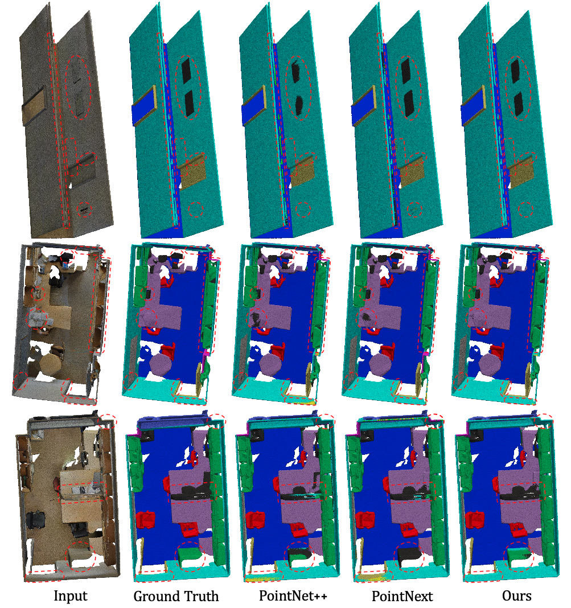

# PointLoop
Full code will be available soon.

## Advantages
- **flexibility and scalability**: PointLoop is an innovative and efficient recurrent hierarchical point cloud representation framework with low parameter counts and computational complexity. It achieves an impressive equilibrium among performance, parameter count, and computation.
- **plug-and-play**: We propose MNPNet, a plug-and-play module for capturing local spatial geometry features of the point cloud. It enhances the ability of local feature abstraction from point clouds. Moreover, it can be easily integrated into other point-based networks.

## Visualization

